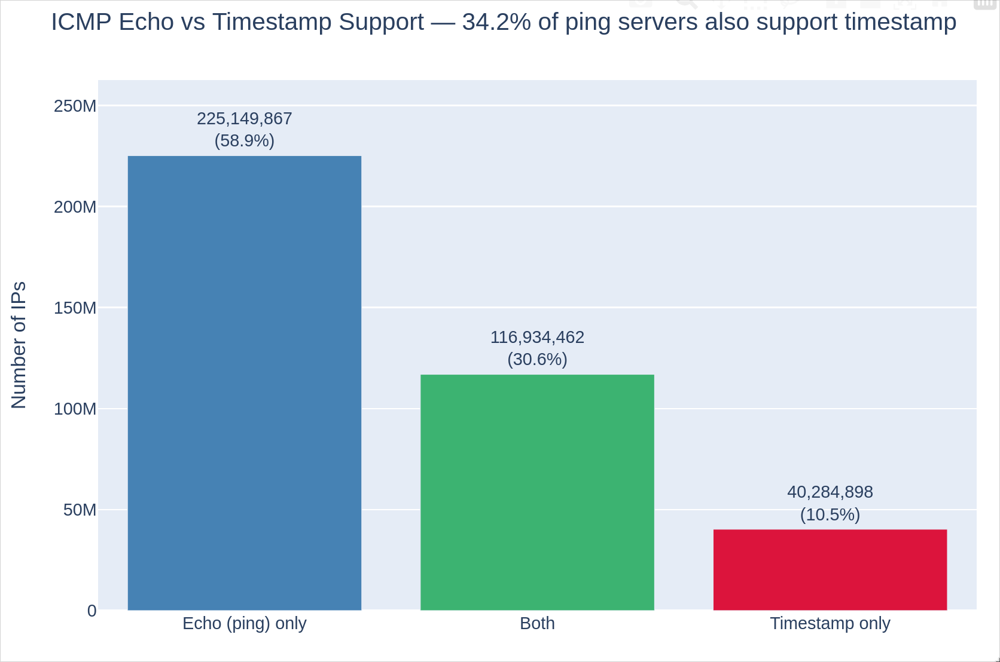
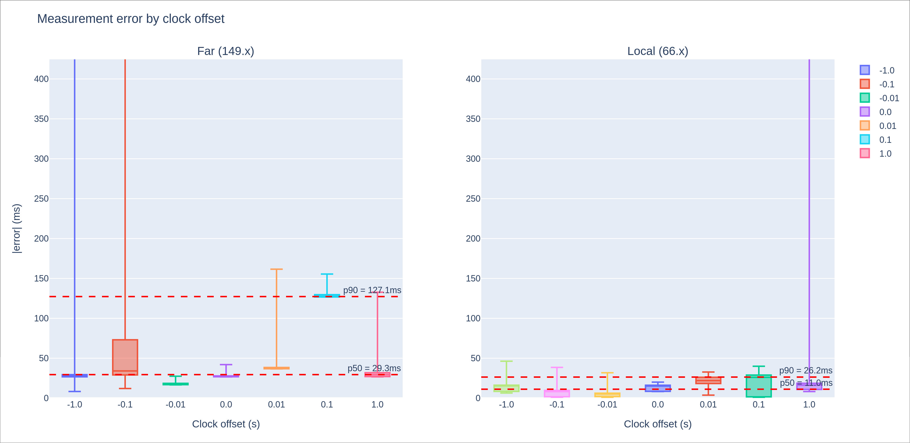
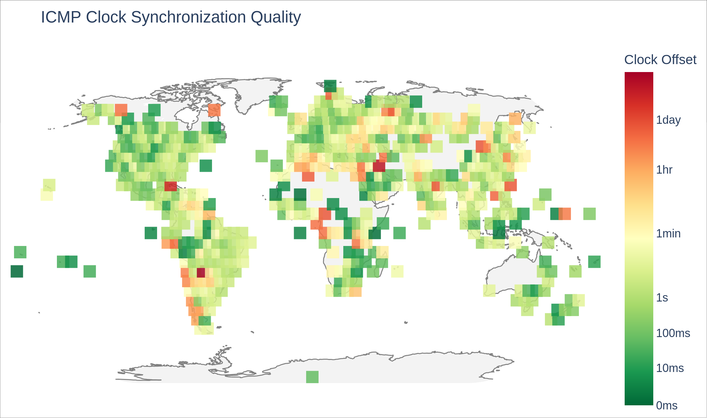
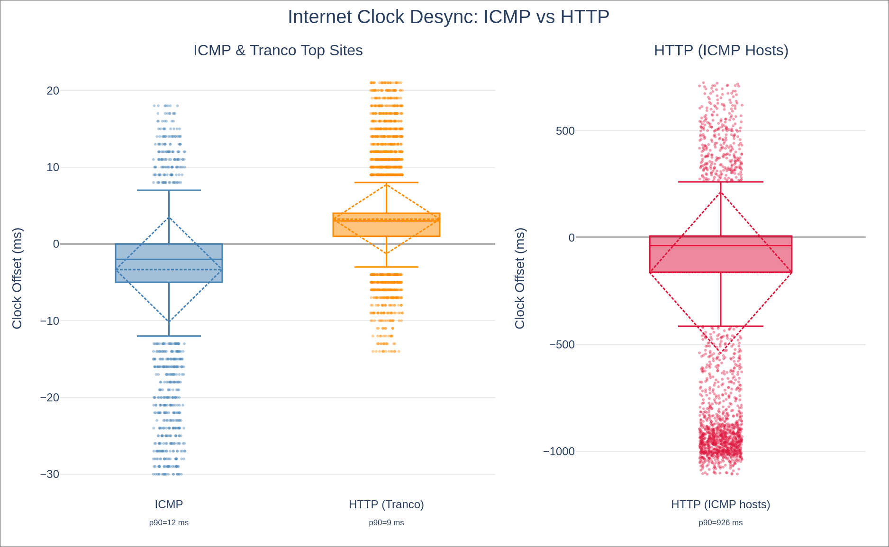

## Motivation

I got interested in this because I wanted a way to **infer the accurate remote time of an arbitrary host** — for example, if you want to "hit" an endpoint at a very precise moment in its own time.

That led to a broader question: **how in sync are internet clocks at all?**

I'd assume most servers use NTP to sync their clocks, but what is the true distribution of clock offsets?

---

## Research Questions

- **RQ1:** How accurate are internet clocks at scale — what fraction of hosts are seriously off?
- **RQ2:** Does geographic region predict clock accuracy?
- **RQ3:** Does a site's Tranco popularity rank correlate with clock accuracy?
- **RQ4:** Can the HTTP `Date` header be exploited to measure clock offsets with sub-second precision, and how does it stack up against ICMP?
- **RQ5:** How widely do IPv4 hosts support ICMP timestamp messages, and how does that compare to plain ping?

# Measuring Clock Offsets

Trying two approaches:

- ICMP Timestamp
- HTTP `Date` Header

## ICMP Timestamp Messages

:::: {.columns}

::: {.column width="50%"}
```{mermaid}
sequenceDiagram
    participant C as Client
    participant S as Server
    Note over C: T₁ (originate)
    C->>S: Timestamp Request
    Note over S: T₂ (receive)
    Note over S: T₃ (transmit)
    S->>C: Timestamp Reply
    Note over C: T₄ (receive)
```
:::

::: {.column width="50%"}
$$\text{rtt} = (T_4 - T_1) - (T_3 - T_2)$$
$$\Delta = T_2 - \left(T_1 + \frac{\text{rtt}}{2}\right)$$

ICMP has a built-in "timestamp" message type (not just ping). You send a request with your local time $T_1$; the server stamps when it received ($T_2$) and retransmitted ($T_3$); you record receipt time $T_4$.

This is essentially what the `clockdiff` utility does — I just built it into a **Zmap module** to scan the whole IPv4 space.
:::

::::

::: {.callout-note}
7.6% of hosts flip the high bit of their timestamp, signaling a "non-standard" (non-wall-clock) value — the RFC allows this. I exclude those hosts from clock-accuracy analysis.
:::

---

## How Much of the Internet Supports It?

{fig-align="center"}

Most hosts (58.9%) respond to ping but **not** ICMP timestamp. But there are some that are the reverse!

Of the 216M+ ICMP-timestamp-responsive hosts, **49.2 million** (31%) responded to ICMP Timestamp but *rejected* ICMP Echo — meaning standard ping would declare them unreachable.

Examples: `162.141.210.115`, `193.0.137.163` — respond to ICMP Timestamp but not ICMP Echo.

---

## The HTTP `Date` Header

Every HTTP server with a clock is required by RFC 9110 to include a `Date` header on 2xx/3xx/4xx responses:

```
Date: Tue, 15 Nov 1994 08:12:31 GMT
```

The catch: **second-level granularity only**, no fractional seconds. If most servers are accurate to within a second, this doesn't get us very far on its own.

The trick is to pay very careful attention to the **bleeding edge of the second**.

---

## HTTP Binary Search Algorithm

My approach: send many `HEAD` requests right around a second boundary and find **when the server's reported second ticks over**.

1. Sleep until my next precise second boundary
2. Send a burst of evenly-spaced requests spanning a window around that boundary
3. Find the "boundary pair" — the last request that saw second $N$ and the first that saw second $N+1$
4. Use the RTT and timing to compute the offset (same math as ICMP clockdiff)
5. **Binary search:** shrink the window around the new transition point and repeat

I add a random query string (`?q=<random>`) to avoid caching

---

## Binary Search — Example Trace

<iframe src="figures/binary-search-trace.html" width="100%" height="560" style="border:none;"></iframe>

---

## Parameter Tuning with Optuna

:::: {.columns}

::: {.column width="55%"}
I set up fake HTTP servers in Ohio, Atlanta, Chicago, and Sydney that respond with **synthetic offsets** (e.g. `GET /0.1` introduces a 100ms artificial delay).

Then I optimized my parameters against known offsets using **Optuna** (>1000 trials).
:::

::: {.column width="45%"}
| Parameter | Value |
|:---|---:|
| Rounds | 17 |
| Probes per round | 18 |
| Initial half-span (µs) | 1,750,000 |
| Minimum step (µs) | 4,300 |
| Shrink factor | 5 |
| Best-of | 2 |
:::

::::

## How Good Are These Parameters?

{fig-align="center"}

The synthetic offset doesn't substantially affect the error — the algorithm is largely agnostic to how far off the clock is. Error P90 is as low as **25.2ms** for local hosts. Sydney (high RTT) has more outliers but is generally comparable.

# Results

## ICMP vs. HTTP Accuracy

<iframe src="figures/clock-accuracy-method-comparison.html" width="100%" height="600" style="border:none;"></iframe>

Both methods concentrate around 0 — where the server is in sync. But the HTTP distribution is wider, meaning it's less precise than raw ICMP clockdiff. These are the **same hosts**, so theoretically they should overlap completely.

---

## Is the World in Sync?

| Scan | Hosts | >5s off | % |
|:---|---:|---:|---:|
| ICMP (full IPv4) | 157,929,504 | 58,223,197 | 36.87% |
| HTTP+ICMP (via ICMP) | 7,882 | 1,894 | 24.03% |
| HTTP+ICMP (via HTTP) | 7,860 | 1,236 | 15.73% |
| Tranco top sites (via HTTP) | 14,938 | 427 | 2.86% |

Most clocks are accurate, but a **non-trivial fraction are off by days, months, or years**. The Tranco list fares much better.

---

## Geographic Distribution

{fig-align="center"}

The distribution of clock offsets is surprisingly uniform.

North America trends slightly more accurate, but no region stands out as dramatically better or worse.

---

## General Offset Distribution

{fig-align="center"}

Box plots for: all ICMP-responsive IPv4 hosts (left), Tranco HTTP sites (middle), and ICMP+HTTP overlap (right). The majority of hosts have offsets well within a second. P90 is 9–15ms for most groups.

The ICMP+HTTP group is noisier via HTTP than even the general ICMP population — those servers tend to be older and don't handle the burst probing as gracefully.

---

## Tranco Rank vs. Clock Accuracy

<iframe src="figures/tranco_vs_http_clock_offset.html" width="100%" height="600" style="border:none;"></iframe>

I hypothesized that more popular/active sites would have better-maintained clocks. **No such correlation exists.** Popularity is a poor predictor of clock accuracy — clocks are either in sync or wildly off, regardless of where you fall on the Tranco list.

## Interesting Outliers

Some interesting anecdotes from my data:

- **`89.86.248.14`** (France) and **`211.116.45.165`** (South Korea): both +48.9 days via ICMP (32-bit int max, possibly uptime counter?)
- **`41.70.48.34`** (Malawi): +44 years via HTTP, but only ~3 minutes off via ICMP; garbage timestamp?
- **`ais.de`** (Tranco list): +78 days off
- **Vanderbilt.edu**: `Date` header was frozen 84 seconds in the past due to Cloudfront caching

# Conclusions & Next Steps

## What I Found

- Most clocks are accurate to within a second
- But a meaningful minority of the general IPv4 population has extreme offsets (days, months, years)
- Geography and popularity are both poor predictors of clock accuracy
- The HTTP binary-search method can work! It's less precise than ICMP clockdiff, but it makes clock measurement possible on any HTTP-speaking host

---

## What I'd Do Next

- Run Zmap to find **NTP servers** that also respond to ICMP and HTTP, to compare our methods against a real source of truth
- **Host NTP servers passively** and collect data on how desynced clients are — a completely passive measurement approach
- **Measure clock skew** (rate of drift) by repeating HTTP measurements over time, not just absolute offset
- Dig deeper into **HTTP `Date` header caching** — how common is it, and what other RFC violations are out there?
- **OS fingerprinting** on bad-clock hosts — what kinds of systems are most prone to this?

---

## Thanks

All code and analysis scripts are available at:

[github.com/404Wolf/csds426-clock-project](https://github.com/404Wolf/csds426-clock-project)
